# STM32串口通信 (STM32CubeMX)

## 一、使用STM32CubeMX配置串口初始化代码

### 1. 新建STM32CubeMX工程

点击**STM32CubeMX**主页面左上角的 **"File" -> "NewProject"**，新建一个工程文件。

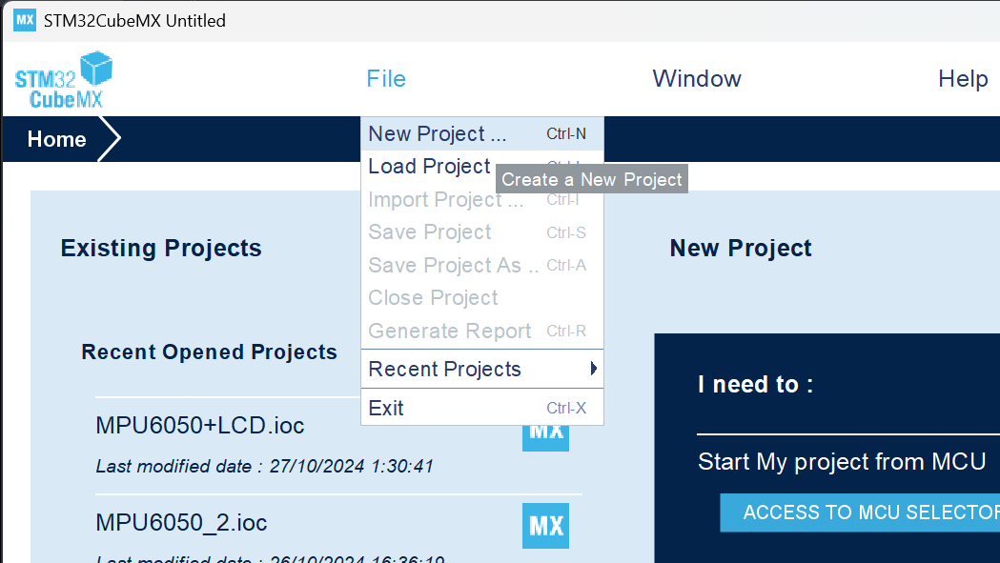

### 2. 选择单片机型号

在新跳出的页面左侧下拉列表中输入所使用的芯片型号，在右下角的芯片列表中选中目标芯片，点击右上角的 **"Start Project"**。*(本文中使用STM32F103C6T6A举例)*

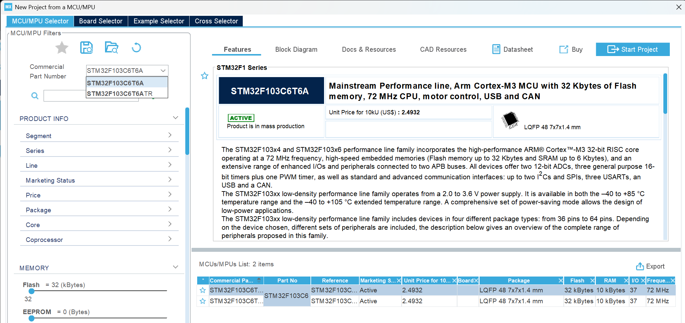

### 3. 配置外部高速时钟

左侧拉开**System Core**列表选中**RCC**，在右侧的**High Speed Clock**下拉列表中选择**Crystal**配置外部高速时钟。

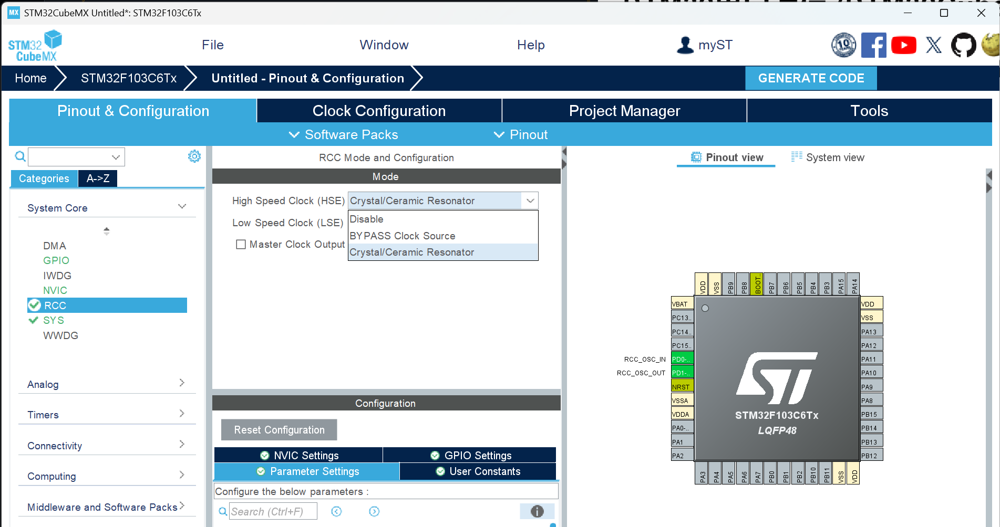

### 4. 配置串口

左侧拉开**Connectivity**列表选中**USART1**，在右侧的**Mode**下拉列表中选择**Asynchronous**配置串口。

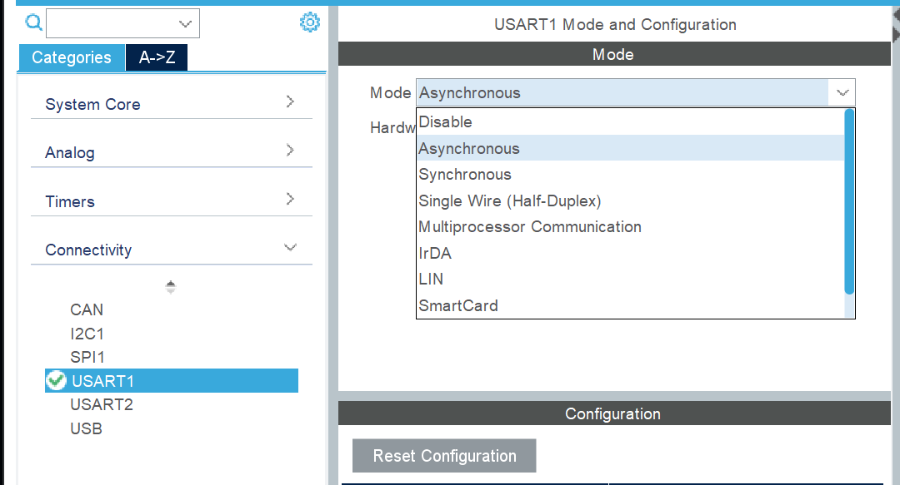

可以在下方**Parameter Settings**选项卡中进行串口的配置，需保证后期所用的串口监视器或其他串口读取程序按照该配置进行设置，才能正常读取数据。

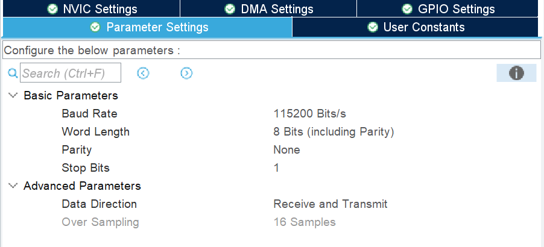

### 5. 配置时钟

选择上方**Clock Configuration**进行时钟配置。两处均选择最下方的选项，**HCLK**中调整为最大速度。*(本文中为72)*

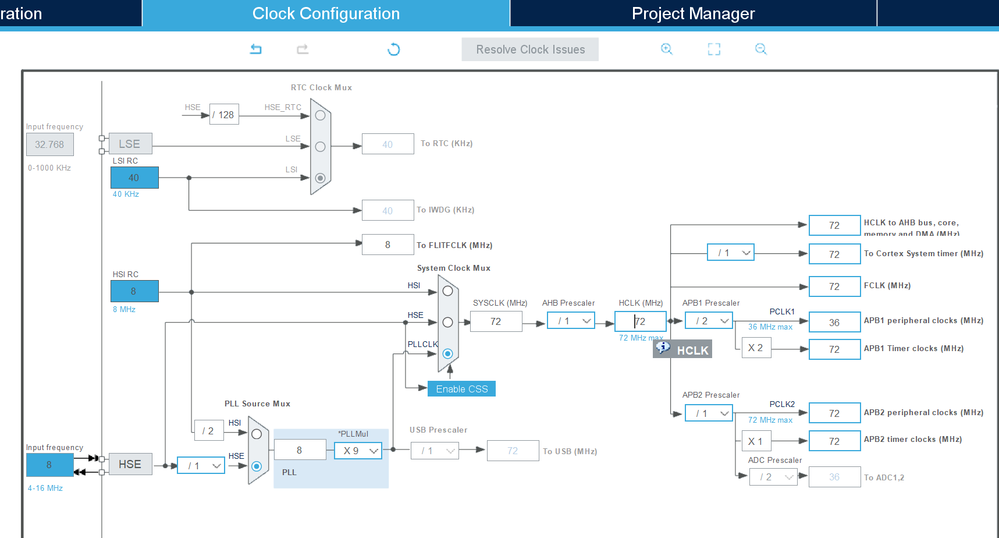

### 6. 设置工程

选择上方**Project Manager**进行工程配置。在下方对应位置输入**工程名称、工程位置、工程编辑器**。*(本文中后面用**Keil5**对工程进行编写，所以此处下拉选择**MDK-ARM**)*

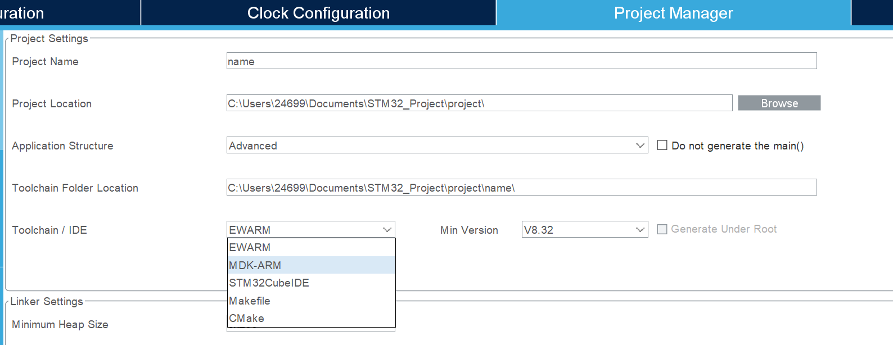

左侧进入**Code Generator**，右侧第一个选项卡选择第二个选项，第二个选项卡选择上第一个选项。最后点击右上角的**GENERATE CODE**生成工程文件。可以在新生成的文件夹中找到**Keil5**的工程，双击打开即可。

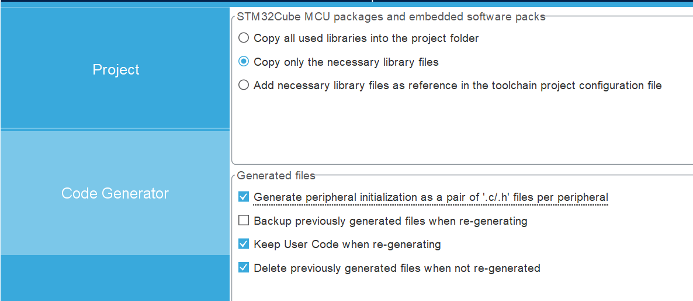

## 二、进入Keil5调整工程文件配置

### 1. 加入输出重定向代码

左侧找到**main.c**文件并打开。

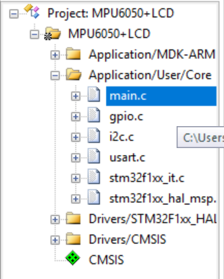

我们需要把C语言标准库里的 **printf** 重定向成串口输出；在代码中加入重定向代码。

```c
#include <stdio.h>
extern UART_HandleTypeDef huart1;   //声明串口
int fputc(int ch, FILE *f)     // 输出重定向
{
  HAL_UART_Transmit(&huart1, (uint8_t *)&ch, 1, 0xffff);
  return ch;
}
int fgetc(FILE *f)
{
  uint8_t ch = 0;
  HAL_UART_Receive(&huart1, &ch, 1, 0xffff);
  return ch;
}
```

注意要把相关代码写在 `/* USER CODE BEGIN */` 和 `/* USER CODE END */` 之间，这样在后期用**STM32CubeMX**调整代码时，才能避免被其生成的代码覆盖。

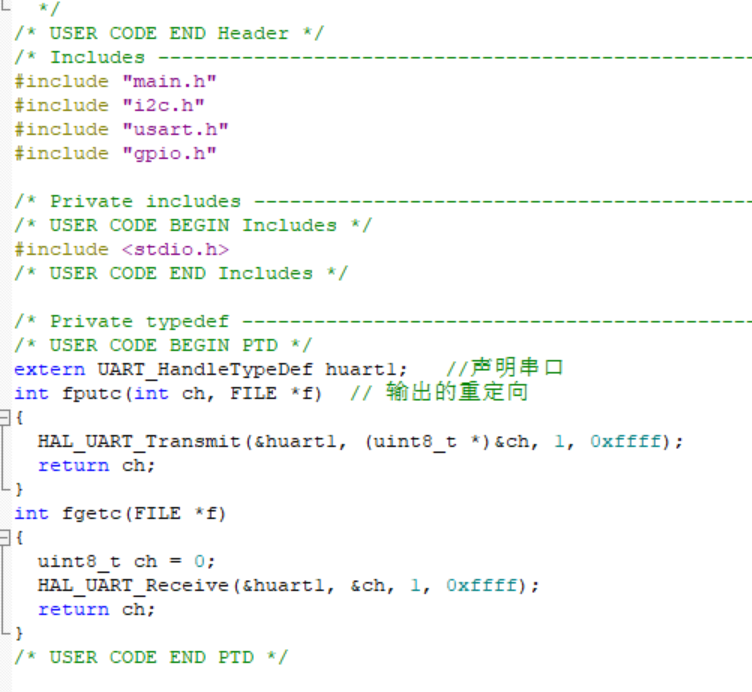

之后在代码里可以直接使用**printf**语句。`printf("Hello STM32! \n");`

### 2. 设置MicroLIB

点击**Keil**上方的**Options for Target**。*(魔法棒)*
在新页面中右上方**Code Generation**选项卡中勾选**Use MicroLIB**，否则编译后的代码无法被运行。

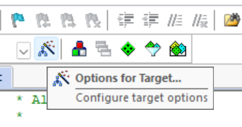
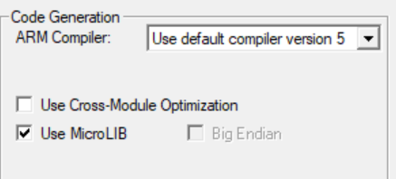

## 三、 烧录运行

### 1. 串口烧录

打开串口烧录工具，选择刚刚用**Keil5**生成的**hex**文件。

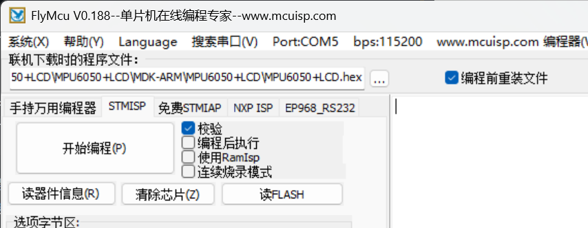

点击**搜索串口**，然后在**Port**串口列表中选择单片机通过串口转换器连接到电脑的端口号。*(本文中为COM4)*

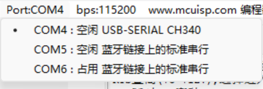

单片机的**A9**和**A10**分别连接串口转换器的**TX**和**RX**。并且调整**BOOT0**的接线方式为**接高电平**。*(本文中使用STM32F103C6T6A的最小系统板，可以通过黄色跳线帽改变接线方式)*


点击串口烧录器的**开始编程**，然后复位STM32使它重新上电。*(由于改变了BOOT0的接线方式，STM32上电后会进入下载模式)*

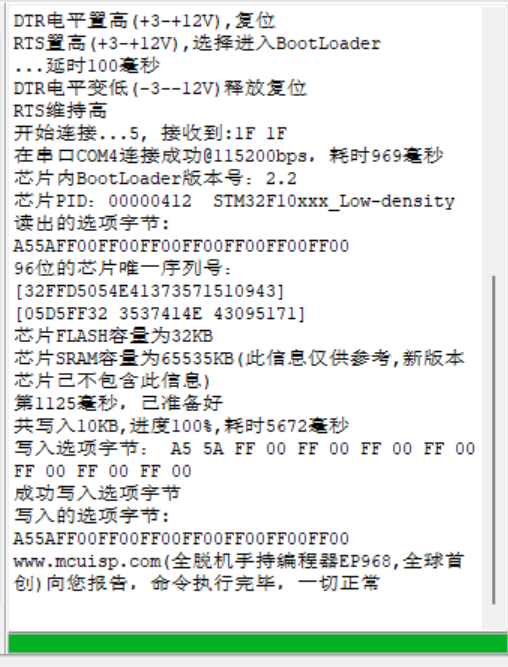

串口烧录器显示写入成功。

### 2. 串口调试工具查看数据接收

写入成功后，将**BOOT0**的接线方式重新改为**低电平**，复位后，STM32即可依照程序正常运行。此时如果打开串口调试工具，在选对配置的情况下可以看到由单片机发送过来的相关数据。
Windows用户可以直接从微软商店下载**串口调试助手**。

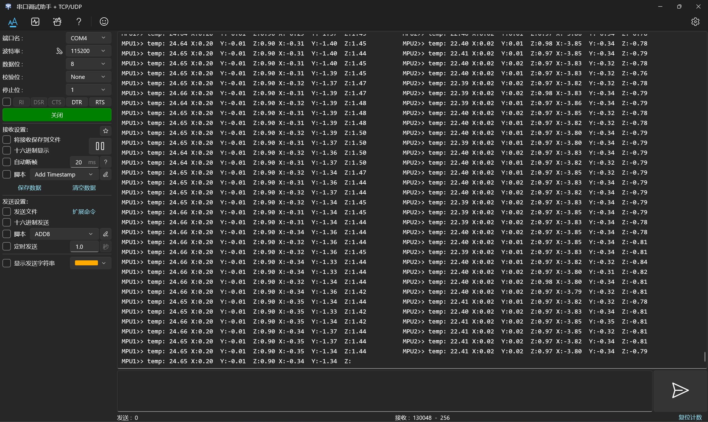

> 上图为使用STM32读取MPU6050陀螺仪，并通过串口发送数据的情况。
